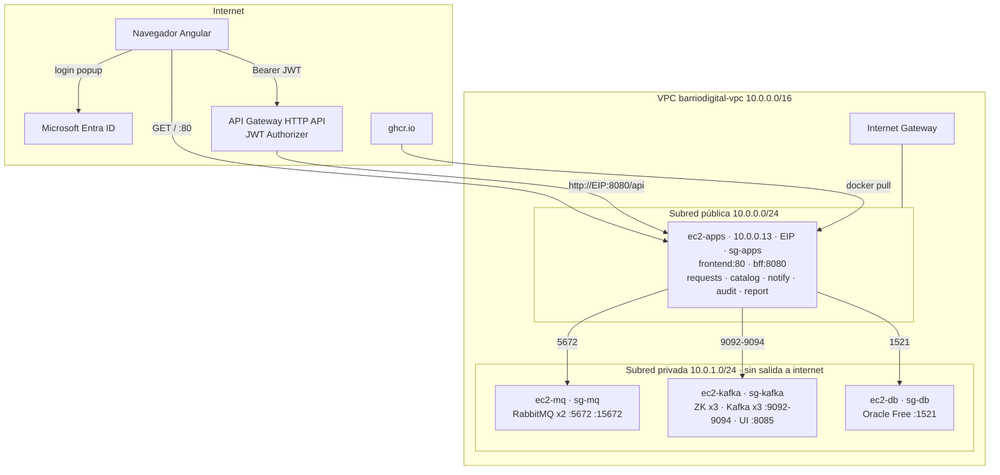

# AWS — Infraestructura BarrioDigital

Cuenta: **AWS Academy Learner Lab** (región `us-east-1`, rol `LabRole`, sin IAM users). Todo se hace por consola; las EC2 se apagan al cerrar cada sesión.

## Topología



**Zonas de seguridad:**

| Zona | Quién vive ahí | Entra tráfico desde | Sale tráfico a |
|---|---|---|---|
| Internet | Entra ID, API Gateway, GHCR | — | — |
| Pública (`10.0.0.0/24`) | `ec2-apps` | Internet (80, 8080), mi IP (22) | Internet (docker pull, JWKS de Entra), privada |
| Privada (`10.0.1.0/24`) | `ec2-mq`, `ec2-kafka`, `ec2-db` | **solo `sg-apps`** | solo dentro de la VPC (no hay NAT) |

¿Quién habla con `ec2-db`? Solo los 4 MS con esquema Oracle: `requests`, `catalog`, `audit`, `report`. Todos corren en `ec2-apps`, así que la única regla de entrada del SG de la BD es `1521 desde sg-apps`. `bff` y `notify` no tienen BD.

## Security Groups

Regla general: **inbound mínimo, referenciando SGs (no CIDRs) entre EC2**; outbound abierto (los MS salen a internet solo desde `ec2-apps`; las privadas físicamente no pueden salir porque no tienen ruta a internet).

| SG | Puerto | Origen | Para qué |
|---|---|---|---|
| `sg-apps` | 22 | Mi IP /32 | SSH + bastion |
| `sg-apps` | 80 | 0.0.0.0/0 | Frontend (nginx) |
| `sg-apps` | 8080 | 0.0.0.0/0 | BFF — lo llama API Gateway (no tiene IP fija para restringir) |
| `sg-mq` | 5672 | `sg-apps` | AMQP (requests → Rabbit, notify ← Rabbit) |
| `sg-mq` | 15672 | `sg-apps` | Management UI vía túnel SSH |
| `sg-mq` | 4369, 25672 | `sg-mq` | Cluster Erlang (rabbitmq1 ↔ rabbitmq2; en 1 EC2 con Docker no es estrictamente necesario, pero no cuesta) |
| `sg-kafka` | 9092-9094 | `sg-apps` | Brokers (requests produce; audit/report consumen) |
| `sg-kafka` | 8085 | `sg-apps` | Kafka UI vía túnel SSH |
| `sg-kafka` | 2181, 2888, 3888 | `sg-kafka` | Zookeeper |
| `sg-db` | 1521 | `sg-apps` | Oracle listener |
| `sg-mq`, `sg-kafka`, `sg-db` | 22 | `sg-apps` | SSH saltando por ec2-apps |

**Nunca** poner 1521, 5672 ni 9092 abiertos a `0.0.0.0/0`. Los puertos 8081-8084 de los MS de dominio **no** se abren en `sg-apps`: solo se alcanzan por la red interna de Docker desde el BFF (`http://requests:8081`). Aunque `compose.yml` los mapea (`ports: 8081:8081`), el SG los bloquea desde afuera.

## ¿Por qué VPC Link sería más seguro? (y por qué no lo usamos)

Con la topología elegida, `ec2-apps` tiene IP pública y el puerto **8080 abierto a todo internet**. Eso es obligatorio porque API Gateway (HTTP API) llama a la integración desde IPs de AWS que cambian; no hay una lista fija que se pueda poner en el SG. Consecuencia: cualquiera que descubra la EIP puede **saltarse el API Gateway** y pegarle al BFF directo.

Lo que nos salva: **el BFF revalida el JWT completo** (firma contra el JWKS de Entra, `iss`, `aud`, `exp`, `scp`, rol) exactamente igual que el Gateway. Por eso la pauta le da 40% a "el BFF valida el token *al igual que el API Manager*": es defensa en profundidad, la capa 2 no confía en la capa 1.

**VPC Link** es el mecanismo para no tener que exponer nada:

1. Creas un VPC Link en API Gateway indicando subredes privadas y un SG (`sg-vpclink`). AWS crea interfaces de red (ENIs) *dentro* de tu VPC.
2. Pones un **ALB interno** (o NLB) en la subred privada con target group → `ec2-apps:8080`.
3. La integración del API Gateway apunta al ALB *a través* del VPC Link.
4. `ec2-apps` pasa a la subred privada, sin IP pública. `sg-alb` acepta 8080 solo desde `sg-vpclink`; `sg-apps` acepta 8080 solo desde `sg-alb`.

Único camino posible: `Internet → API Gateway (valida JWT) → VPC Link → ALB → BFF`. Nadie puede llegar al BFF sin pasar por el authorizer.

Costo de esa opción: ALB ≈ US$16/mes + NAT Gateway ≈ US$32/mes (+ tráfico), porque al quedar todo privado las EC2 necesitan NAT para `docker pull` y para descargar el JWKS de Entra. Además el frontend tendría que ir a S3 + CloudFront. En Learner Lab el presupuesto es de ~US$50-100 totales; no vale la pena para una prueba de 2 semanas. Queda documentado como "así se haría en producción".

## Paso a paso (consola)

### 1. VPC
VPC → *Create VPC* → **VPC only**:
- Name `barriodigital-vpc`, IPv4 CIDR `10.0.0.0/16`.

Subnets → *Create subnet* (×2, misma VPC):
- `barriodigital-public` · `us-east-1a` · `10.0.0.0/24` → luego *Edit subnet settings* → **Enable auto-assign public IPv4**.
- `barriodigital-private` · `us-east-1a` · `10.0.1.0/24`.

Internet gateways → *Create* `barriodigital-igw` → *Attach to VPC*.

Route tables → *Create* `rt-public` (VPC barriodigital) → Routes → add `0.0.0.0/0 → barriodigital-igw` → Subnet associations → `barriodigital-public`.
La privada queda en la route table *main* (solo `10.0.0.0/16 local`). No crees NAT Gateway.

### 2. Security Groups
EC2 → Security Groups → crear los 4 de la tabla de arriba, **todos en `barriodigital-vpc`**. Crea primero `sg-apps` (vacío), después los otros referenciándolo, y al final vuelve a `sg-apps` para agregar reglas.

### 3. Key pair
EC2 → Key pairs → `barriodigital-key` · RSA · `.pem`. Guardar en `~/.ssh/`, `chmod 400`. No va a git (`*.pem` en `.gitignore`).

### 4. EC2 — user-data común (Docker)

```bash
#!/bin/bash
apt-get update -y
apt-get install -y ca-certificates curl git
install -m 0755 -d /etc/apt/keyrings
curl -fsSL https://download.docker.com/linux/ubuntu/gpg -o /etc/apt/keyrings/docker.asc
echo "deb [arch=$(dpkg --print-architecture) signed-by=/etc/apt/keyrings/docker.asc] https://download.docker.com/linux/ubuntu $(. /etc/os-release && echo "$VERSION_CODENAME") stable" > /etc/apt/sources.list.d/docker.list
apt-get update -y
apt-get install -y docker-ce docker-ce-cli containerd.io docker-compose-plugin
usermod -aG docker ubuntu
```

### 5. EC2 — instancias

| Nombre | AMI | Tipo | Disco | Subred | SG | IP privada | IP pública |
|---|---|---|---|---|---|---|---|
| `ec2-apps` | Ubuntu 26.04 | t3.medium | 20 GB | pública `10.0.0.0/24` | sg-apps | `10.0.0.13` | **EIP `100.60.226.205`** |
| `ec2-mq` | Ubuntu 26.04 | t3.small | 16 GB | privada `10.0.1.0/24` | sg-mq | `10.0.1.254` | no |
| `ec2-kafka` | Ubuntu 26.04 | t3.medium | 20 GB | privada `10.0.1.0/24` | sg-kafka | `10.0.1.29` | no |
| `ec2-db` | Ubuntu 26.04 | t3.medium | 30 GB | privada `10.0.1.0/24` | sg-db | `10.0.1.8` | no |

Las IPs privadas **no cambian** al hacer stop/start (la ENI conserva la IP dentro de la subred). Solo se pierden si se termina la instancia.

> Nota: la VPC se creó con el wizard *VPC and more*, por eso los nombres reales son `barriodigital-vpc-vpc`, `barriodigital-vpc-subnet-public1-us-east-1a` (`10.0.0.0/24`), `barriodigital-vpc-subnet-private1-us-east-1a` (`10.0.1.0/24`), `barriodigital-vpc-rtb-public` y `barriodigital-vpc-rtb-private1-us-east-1a`. La AMI es Ubuntu 26.04 LTS (la que aparecía como free tier); el user-data de Docker funciona igual.

**Truco para las privadas (no tienen internet para `apt`/`docker pull`):**
1. Lanzar la instancia **en la subred pública** con el user-data.
2. Entrar por SSH y hacer `docker pull` de las imágenes que va a usar (`gvenzl/oracle-free:23-slim` / `rabbitmq:3.13-management` / `bitnamilegacy/zookeeper:3.9`, `bitnamilegacy/kafka:3.7`, `provectuslabs/kafka-ui:latest`) y `git clone` de `barriodigital-infra`.
3. *Actions → Image → Create image* (AMI `barriodigital-db-base`, etc.).
4. Lanzar desde esa AMI en la subred **privada** con el SG correcto. Terminar la de la pública.

Alternativa más rápida si el tiempo aprieta: dejar las 4 en la pública pero con los SGs de arriba (la seguridad efectiva es casi la misma porque los SGs solo aceptan `sg-apps`); documentar honestamente que se hizo así.

**Elastic IP:** EC2 → Elastic IPs → Allocate → Associate → `ec2-apps`. Anotarla: es la que va en API Gateway, `environment.prod.ts` y en los secrets de CI/CD.

### 6. Oracle en `ec2-db`

```bash
mkdir -p ~/oracle/init && cd ~/oracle
cat > init/01-schemas.sql <<'SQL'
ALTER SESSION SET CONTAINER = FREEPDB1;
CREATE USER barriodigital_requests IDENTIFIED BY "CambiarPass1";
CREATE USER barriodigital_catalog  IDENTIFIED BY "CambiarPass2";
CREATE USER barriodigital_audit    IDENTIFIED BY "CambiarPass3";
CREATE USER barriodigital_report   IDENTIFIED BY "CambiarPass4";
BEGIN
  FOR u IN (SELECT column_value AS name FROM TABLE(sys.odcivarchar2list(
      'BARRIODIGITAL_REQUESTS','BARRIODIGITAL_CATALOG','BARRIODIGITAL_AUDIT','BARRIODIGITAL_REPORT'))) LOOP
    EXECUTE IMMEDIATE 'GRANT CREATE SESSION, CREATE TABLE, CREATE SEQUENCE, CREATE VIEW TO ' || u.name;
    EXECUTE IMMEDIATE 'ALTER USER ' || u.name || ' QUOTA UNLIMITED ON USERS';
  END LOOP;
END;
/
SQL

docker run -d --name oracle --restart unless-stopped \
  -p 1521:1521 \
  -e ORACLE_PASSWORD='SysPassCambiar' \
  -v oracle-data:/opt/oracle/oradata \
  -v ~/oracle/init:/container-entrypoint-initdb.d \
  gvenzl/oracle-free:23-slim
docker logs -f oracle   # esperar "DATABASE IS READY TO USE!"
```

Variables resultantes para `apps/.env`: `DB_HOST=10.0.1.8` (IP privada de ec2-db), `DB_PORT=1521`, `DB_SERVICE=FREEPDB1`, `*_DB_USER` / `*_DB_PASSWORD` según el SQL. Flyway crea las tablas al arrancar cada MS (`V1__init.sql`).

Probar desde `ec2-apps`: `nc -zv 10.0.1.X 1521`.

### 7. RabbitMQ y Kafka en sus EC2

```bash
# ec2-mq
cd ~/barriodigital-infra/mq && docker compose up -d
# ec2-kafka
cd ~/barriodigital-infra/kafka && docker compose up -d
```

Antes hay que aplicar el ítem **D9** de Pendientes (compose multi-host): en cada EC2 los servicios ya no comparten red Docker con `ec2-apps`, así que Kafka debe anunciar la IP privada de `ec2-kafka` y `apps/.env` debe apuntar a las IPs privadas de mq/kafka en vez de `rabbitmq1` / `kafka1`.

### 8. Acceso a las privadas

La `.pem` vive solo en tu PC (`~/.ssh/`, nunca en ec2-apps ni en git). En Windows `ssh -i ... -J ...` **no** pasa la clave al salto, así que se usa `~/.ssh/config`:

```
Host apps
  HostName 100.60.226.205
  User ubuntu
  IdentityFile ~/.ssh/barriodigital-key.pem

Host db
  HostName 10.0.1.8
  User ubuntu
  IdentityFile ~/.ssh/barriodigital-key.pem
  ProxyJump apps

Host mq
  HostName 10.0.1.254
  User ubuntu
  IdentityFile ~/.ssh/barriodigital-key.pem
  ProxyJump apps

Host kafka
  HostName 10.0.1.29
  User ubuntu
  IdentityFile ~/.ssh/barriodigital-key.pem
  ProxyJump apps

Host 10.0.*
  User ubuntu
  IdentityFile ~/.ssh/barriodigital-key.pem
  ProxyJump apps
```

Con eso: `ssh apps`, `ssh db`, `ssh mq`, `ssh kafka` (el salto es automático), `scp -r mq mq:~/` para copiar carpetas, y túneles para las UIs:

```bash
ssh -L 15672:10.0.1.254:15672 -L 8085:10.0.1.29:8085 apps   # luego http://localhost:15672 y :8085
```

En Windows la `.pem` necesita ACL solo para tu usuario. Si el nombre del PC coincide con el del usuario, `icacls` con el nombre apunta al equipo; usa el SID:

```powershell
$sid = [System.Security.Principal.WindowsIdentity]::GetCurrent().User.Value
icacls "$env:USERPROFILE\.ssh\barriodigital-key.pem" /inheritance:r /grant:r "*${sid}:R"
```

### 9. API Gateway (HTTP API)

1. API Gateway → *Create API* → **HTTP API** → Build. Name `barriodigital-api`. Sin integraciones todavía.
2. **Authorization** → *Manage authorizers* → Create → tipo **JWT**:
   - Name `entra-jwt`
   - Identity source `$request.header.Authorization`
   - Issuer URL `https://login.microsoftonline.com/<TENANT_ID>/v2.0`
   - Audience `<API_CLIENT_ID>` (el GUID; ver gotcha en [Entra-ID-y-JWT.md](Entra-ID-y-JWT.md#gotcha-aud-v1-vs-v2))
3. **Routes** → Create → `ANY` `/api/{proxy+}` → attach authorizer `entra-jwt`.
4. **Integrations** → Create → HTTP URI → `http://<EIP>:8080/api/{proxy}` → attach a la ruta.
5. **CORS** → Origins `http://localhost:4200`, `http://<EIP>` · Headers `authorization, content-type` · Methods `GET, POST, PUT, DELETE, OPTIONS` · Max age 3600.
6. Stage `$default` (auto-deploy). **Invoke URL:** `https://dnddhzpvgg.execute-api.us-east-1.amazonaws.com` (API ID `dnddhzpvgg`).

Prueba:

```bash
curl -i https://dnddhzpvgg.execute-api.us-east-1.amazonaws.com/api/catalog/procedures            # 401 {"message":"Unauthorized"}
curl -i -H "Authorization: Bearer $TOKEN" https://dnddhzpvgg.execute-api.us-east-1.amazonaws.com/api/catalog/procedures   # 200
curl -i -H "Authorization: Bearer $TOKEN_SIN_ROL" -X POST ... /api/catalog/procedures     # 403 del BFF {"error":"acceso_denegado"}
```

### 10. Al final de cada sesión
EC2 → seleccionar las 4 → *Instance state → Stop*. La EIP se mantiene asociada. Las IPs privadas también se mantienen (misma subred).
