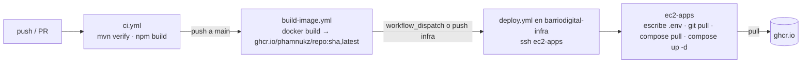

# CI/CD — BarrioDigital

Restricción: **AWS Academy Learner Lab** no permite crear IAM users ni OIDC providers, y las credenciales de la sesión expiran cada ~4 h. Entonces GitHub Actions **no puede hablar con AWS** de forma estable (ni ECR, ni `aws deploy`). Solución: las imágenes van a **GHCR** (registry de GitHub, gratis) y el deploy es un **SSH** a `ec2-apps` que hace `docker compose pull && up`.

## Pipeline



| Repo | `ci.yml` | `build-image.yml` | `deploy.yml` |
|---|---|---|---|
| 6 × `ms-barriodigital-*` | ✅ Java | ✅ | — |
| `frontend-barriodigital` | ✅ Angular | ✅ | — |
| `barriodigital-infra` | — (solo `docker compose config`) | — | ✅ |
| `barriodigital-docs` | — | — | — |

## Prerrequisitos (Pendientes F1, F2, G5)

### Dockerfile Java (bff / requests / catalog — copiar el de audit y cambiar `EXPOSE`)

```dockerfile
FROM maven:3.9-eclipse-temurin-17 AS build
WORKDIR /app
COPY pom.xml .
COPY src src
RUN mvn -q -DskipTests clean package

FROM eclipse-temurin:17-jre
WORKDIR /app
COPY --from=build /app/target/*.jar app.jar
EXPOSE 8080
ENTRYPOINT ["java", "-jar", "app.jar"]
```

### Dockerfile frontend (`frontend-barriodigital/Dockerfile`)

```dockerfile
FROM node:20-alpine AS build
WORKDIR /app
COPY package*.json ./
RUN npm ci
COPY . .
RUN npm run build -- --configuration production

FROM nginx:alpine
COPY --from=build /app/dist/frontend-barriodigital/browser /usr/share/nginx/html
COPY nginx.conf /etc/nginx/conf.d/default.conf
EXPOSE 80
```

`frontend-barriodigital/nginx.conf`:

```nginx
server {
  listen 80;
  root /usr/share/nginx/html;
  index index.html;
  location / { try_files $uri $uri/ /index.html; }
}
```

> Verificar la ruta de salida: en Angular 17 con `application` builder es `dist/<project>/browser`; confirmar `outputPath` en `angular.json`. Y `.dockerignore` con `node_modules`, `dist`, `.git`.

### `apps/compose.yml`: `build:` → `image:`

```yaml
  bff:
    image: ghcr.io/phamnukz/ms-barriodigital-bff:latest
    # ...
```

Y para seguir desarrollando local, `apps/compose.override.yml` (Compose lo mezcla solo si existe; en EC2 no se clona con override):

```yaml
services:
  frontend: { build: ../../frontend-barriodigital }
  bff:      { build: ../../ms-barriodigital-bff }
  requests: { build: ../../ms-barriodigital-requests }
  catalog:  { build: ../../ms-barriodigital-catalog }
  notify:   { build: ../../ms-barriodigital-notify }
  audit:    { build: ../../ms-barriodigital-audit }
  report:   { build: ../../ms-barriodigital-report }
```

## Workflows

### `ci.yml` — Java (6 MS)

```yaml
name: ci
on:
  push:
    branches: [main]
  pull_request:

jobs:
  test:
    runs-on: ubuntu-latest
    steps:
      - uses: actions/checkout@v4
      - uses: actions/setup-java@v4
        with:
          distribution: temurin
          java-version: '17'
          cache: maven
      - run: mvn -B verify
```

Los tests usan `application-test.yml` (H2 + JWT mock, Kafka listener apagado) — no necesitan Oracle, Rabbit ni Azure. Si alguno falla en CI por eso, es un bug del test, no del pipeline.

### `ci.yml` — Angular

```yaml
name: ci
on:
  push:
    branches: [main]
  pull_request:

jobs:
  build:
    runs-on: ubuntu-latest
    steps:
      - uses: actions/checkout@v4
      - uses: actions/setup-node@v4
        with:
          node-version: '20'
          cache: npm
      - run: npm ci
      - run: npm run build -- --configuration production
```

### `build-image.yml` — los 7 repos de código (idéntico en todos)

```yaml
name: build-image
on:
  push:
    branches: [main]
  workflow_dispatch:

permissions:
  contents: read
  packages: write

jobs:
  image:
    runs-on: ubuntu-latest
    steps:
      - uses: actions/checkout@v4
      - uses: docker/login-action@v3
        with:
          registry: ghcr.io
          username: ${{ github.actor }}
          password: ${{ secrets.GITHUB_TOKEN }}
      - uses: docker/build-push-action@v6
        with:
          context: .
          push: true
          tags: |
            ghcr.io/${{ github.repository }}:latest
            ghcr.io/${{ github.repository }}:${{ github.sha }}
```

`github.repository` = `PhamNukz/ms-barriodigital-bff` → GHCR lo baja a minúsculas: `ghcr.io/phamnukz/ms-barriodigital-bff`. **No necesita secrets**: `GITHUB_TOKEN` viene solo.

Después del primer push: repo → *Packages* (barra derecha) → el package → *Package settings* → **Change visibility → Public**. Si no, `ec2-apps` necesita `docker login ghcr.io -u PhamNukz -p <PAT read:packages>` una vez.

### `deploy.yml` — solo en `barriodigital-infra`

```yaml
name: deploy
on:
  push:
    branches: [main]
    paths: ['apps/**']
  workflow_dispatch:

jobs:
  deploy:
    runs-on: ubuntu-latest
    steps:
      - uses: appleboy/ssh-action@v1
        with:
          host: ${{ secrets.EC2_HOST }}
          username: ${{ secrets.EC2_USER }}
          key: ${{ secrets.EC2_SSH_KEY }}
          script: |
            set -e
            cd ~/barriodigital-infra
            git pull --ff-only
            printf '%s\n' "${{ secrets.APPS_ENV }}" > apps/.env
            cd apps
            docker compose pull
            docker compose up -d --remove-orphans
            docker image prune -f
```

`ec2-apps` tiene que tener `~/barriodigital-infra` clonado (`git clone https://github.com/PhamNukz/barriodigital-infra.git`) — el user-data ya instala git.

Cuando cambia el código de un MS (no la infra): mergear a `main` del MS → `build-image` sube `:latest` → ir a `barriodigital-infra → Actions → deploy → Run workflow`. Si quieren que sea automático, agregar al final de `build-image.yml` de cada MS un `repository_dispatch` hacia infra (necesita un PAT con `repo` como secret `INFRA_DISPATCH_TOKEN`); para la prueba, el botón manual basta.

## Secrets

| Repo | Secret | Valor | Quién lo genera |
|---|---|---|---|
| `barriodigital-infra` | `EC2_HOST` | Elastic IP de `ec2-apps` | AWS (D3) |
| `barriodigital-infra` | `EC2_USER` | `ubuntu` | — |
| `barriodigital-infra` | `EC2_SSH_KEY` | clave privada **dedicada** (`deploy_key`), completa con `-----BEGIN…END-----` | paso de abajo |
| `barriodigital-infra` | `APPS_ENV` | contenido completo de `apps/.env` (Azure IDs, IPs privadas, passwords Oracle) | ustedes, a mano |
| 7 repos de código | *(ninguno)* | `GITHUB_TOKEN` es automático | — |

Los 7 MS **no** reciben los IDs de Azure ni passwords en build: la imagen es la misma para cualquier tenant, todo entra por variables de entorno en runtime (`application.yml` ya lee `${AAD_ISSUER_URI}` etc.). Eso es lo correcto: 1 imagen, N entornos.

### Clave SSH dedicada al deploy

```bash
ssh-keygen -t ed25519 -f deploy_key -C barriodigital-deploy -N ""
# pública → ec2-apps
ssh -i ~/.ssh/barriodigital-key.pem ubuntu@<EIP> 'cat >> ~/.ssh/authorized_keys' < deploy_key.pub
# privada → GitHub: barriodigital-infra → Settings → Secrets and variables → Actions → New repository secret → EC2_SSH_KEY
cat deploy_key
rm deploy_key deploy_key.pub   # no queda en disco
```

No usar la `.pem` del key pair de AWS en GitHub: si se filtra, hay que rotar 4 EC2; la deploy key se revoca borrando una línea de `authorized_keys`.

### `.env` de referencia para `APPS_ENV`

```
AAD_ISSUER_URI=https://login.microsoftonline.com/<TENANT_ID>/v2.0
AAD_API_CLIENT_ID=<API_CLIENT_ID>
AAD_REQUIRED_SCOPE=access_as_user
CORS_ALLOWED_ORIGINS=http://<EIP>,http://localhost:4200

DB_HOST=10.0.2.X
DB_PORT=1521
DB_SERVICE=FREEPDB1
REQUESTS_DB_USER=barriodigital_requests
REQUESTS_DB_PASSWORD=...
CATALOG_DB_USER=barriodigital_catalog
CATALOG_DB_PASSWORD=...
AUDIT_DB_USER=barriodigital_audit
AUDIT_DB_PASSWORD=...
REPORT_DB_USER=barriodigital_report
REPORT_DB_PASSWORD=...

MQ_PRIVATE_IP=10.0.2.Y
KAFKA_PRIVATE_IP=10.0.2.Z
RABBITMQ_USER=guest
RABBITMQ_PASSWORD=guest
```

(`MQ_PRIVATE_IP` / `KAFKA_PRIVATE_IP` existen después del ítem D9.)

## Branch protection (F7, opcional)
Repo → Settings → Branches → *Add rule* → `main` → *Require a pull request before merging* + *Require status checks* → elegir `test` (Java) / `build` (Angular). Con eso nadie mergea con CI rojo. En pareja es útil; si estorba por el tiempo, saltarlo.

## Qué mostrar en la presentación
1. Actions verde en un MS (`ci` + `build-image`).
2. Package en GHCR con tag `latest` y `sha`.
3. `deploy` corriendo por `workflow_dispatch` y el log del `docker compose up`.
4. `docker ps` en `ec2-apps` con las 7 imágenes `ghcr.io/…`.
