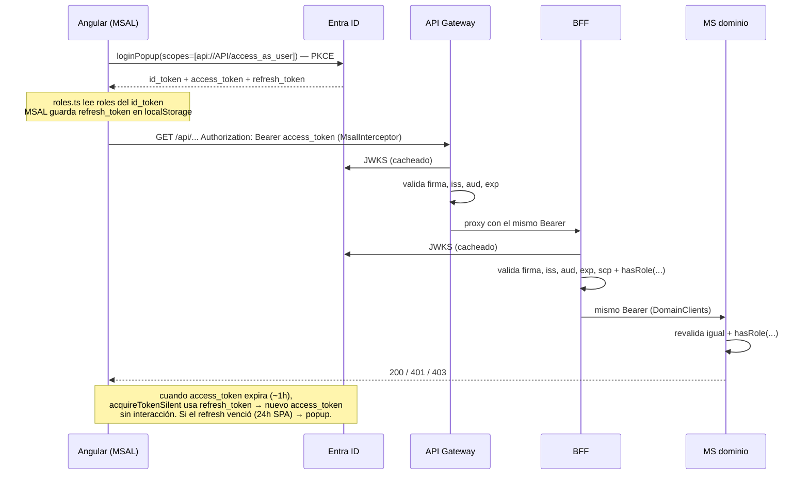

# Microsoft Entra ID (Azure AD) + JWT — BarrioDigital

Esto cubre el 100% de la pauta EP1: indicador 1 (MSAL en Angular, 60%) e indicador 2 (BFF valida el JWT, 40%).

## Modelo: 2 App Registrations

El caso menciona una sola App Registration "BarrioDigital". El código ya está escrito para el patrón recomendado por Microsoft de **dos**: una para la SPA (quién pide el token) y otra para la API (a quién va dirigido). Funciona igual con una sola, pero con dos el `aud` del token queda limpio y se puede revocar la SPA sin tocar la API.

| App Registration | Rol | Quién la usa | Dato que sale de aquí |
|---|---|---|---|
| `barriodigital-api` | Resource / API protegida | API Gateway, BFF, 4 MS | `API_CLIENT_ID`, scope `access_as_user`, App Roles |
| `barriodigital-spa` | Cliente público (SPA) | `frontend-barriodigital` | `SPA_CLIENT_ID` |
| Tenant | — | todos | `TENANT_ID` |

## Paso a paso (portal.azure.com → Microsoft Entra ID)

### 1. `barriodigital-api`
1. *App registrations → New registration*: name `barriodigital-api`, *Accounts in this organizational directory only*, sin redirect URI. Register.
2. **Expose an API** → *Application ID URI* → Set → dejar `api://<API_CLIENT_ID>` → Save.
3. *Add a scope*: name `access_as_user`, *Admins and users*, display "Acceder a BarrioDigital como el usuario", Enable.
4. **App roles** → *Create app role* ×4:

   | Display name | Allowed member types | Value | Description |
   |---|---|---|---|
   | Admin | Users/Groups | `Admin` | Define tipos, cupos, ve KPIs |
   | Funcionario | Users/Groups | `Funcionario` | Admite, asigna cuadrilla, cierra |
   | Vecino | Users/Groups | `Vecino` | Ingresa y sigue trámites |
   | Auditor | Users/Groups | `Auditor` | Timeline solo lectura |

   Los `Value` tienen que ser **exactamente** esos: `JwtRolesConverter` los convierte a `ROLE_Admin`, etc., y `SecurityConfig` hace `hasRole("Admin")`.
5. **Manifest** → buscar `requestedAccessTokenVersion` (en manifests antiguos `accessTokenAcceptedVersion`) → poner `2` → Save. Esto hace que el access token sea v2.0 (`iss` = `login.microsoftonline.com/<tenant>/v2.0`), que es lo que esperan el API Gateway y `application.yml`.
6. Anotar **Application (client) ID** → `API_CLIENT_ID` y **Directory (tenant) ID** → `TENANT_ID`.

### 2. `barriodigital-spa`
1. *New registration*: name `barriodigital-spa`, single tenant, plataforma **Single-page application**, redirect `http://localhost:4200`. Register.
2. **Authentication** → agregar redirect de prod `http://<EIP>` (y después HTTPS si lo hay); *Front-channel logout URL* la misma. Implicit grant: **nada marcado** (MSAL v3 usa PKCE).
3. **API permissions** → *Add a permission → My APIs → barriodigital-api → access_as_user* → Add → **Grant admin consent for <tenant>** (si no tienes rol de admin en el tenant, cada usuario aceptará el consentimiento en el primer login; con cuenta de estudiante Duoc esto normalmente requiere que el tenant sea uno propio — crear tenant gratuito en *Entra → Manage tenants → Create* si el de Duoc no deja registrar apps).
4. Anotar **Application (client) ID** → `SPA_CLIENT_ID`.

### 3. Asignar roles a usuarios
*Enterprise applications → barriodigital-api → Users and groups → Add user/group* → elegir usuario → elegir rol. Mínimo 4 usuarios (uno por rol) para la demo. Si un usuario no tiene rol asignado, el token viene **sin claim `roles`** y todo endpoint con `hasRole` responde 403 — es el error más común.

Si el tenant no permite crear usuarios: en *Enterprise applications → barriodigital-api → Properties* dejar *Assignment required? = No* y asignar roles solo a los que existan.

### 4. Copiar los valores

`frontend-barriodigital/src/environments/environment.ts`:
```ts
msalClientId: '<SPA_CLIENT_ID>',
msalTenantId: '<TENANT_ID>',
apiScope: 'api://<API_CLIENT_ID>/access_as_user',
apiBaseUrl: 'http://localhost:8080',   // local: BFF directo; prod: Invoke URL del API Gateway
```

`barriodigital-infra/apps/.env`:
```
AAD_ISSUER_URI=https://login.microsoftonline.com/<TENANT_ID>/v2.0
AAD_API_CLIENT_ID=<API_CLIENT_ID>        # GUID pelado, ver gotcha abajo
AAD_REQUIRED_SCOPE=access_as_user
```

## Gotcha: `aud` v1 vs v2

| Versión token | `iss` | `aud` |
|---|---|---|
| v1.0 (default si no tocas el manifest) | `https://sts.windows.net/<tenant>/` | `api://<API_CLIENT_ID>` |
| **v2.0** (con `requestedAccessTokenVersion: 2`) | `https://login.microsoftonline.com/<tenant>/v2.0` | **`<API_CLIENT_ID>`** (GUID) |

Hoy los 5 `application.yml` tienen `audiences: [api://<API_CLIENT_ID>]`. Con token v2 eso **falla** (`AudienceValidator` → "El claim aud no corresponde a esta API" → 401). Fix (ítem **A8** de Pendientes), en los 5 MS:

```yaml
barriodigital:
  security:
    audiences:
      - ${AAD_API_CLIENT_ID}
      - api://${AAD_API_CLIENT_ID}
```

Y en el API Gateway el authorizer lleva el GUID pelado.

## Los tokens — qué hay y quién usa cada uno



| Token | Formato | Vida | Contiene | Dónde se usa en nuestro código |
|---|---|---|---|---|
| **id_token** | JWT, `aud` = SPA_CLIENT_ID | ~1 h | `name`, `preferred_username`, `oid`, **`roles`** | `auth/roles.ts` (`idTokenClaims.roles`) → mostrar rol en topbar, guards por rol (B3) |
| **access_token** | JWT, `aud` = API_CLIENT_ID | ~60-90 min | `iss`, `aud`, `exp`, `nbf`, **`scp`** = `access_as_user`, **`roles`**, `oid`, `preferred_username` | `MsalInterceptor` lo mete en `Authorization: Bearer` para URLs de `protectedResourceMap`. Lo validan API Gateway, `AudienceValidator` + `JwtDecoder` (firma/iss/exp), `JwtRolesConverter` (roles → authorities), `SecurityConfig` (hasRole) |
| **refresh_token** | opaco | 24 h (SPA, no extensible) | — | Solo MSAL. `acquireTokenSilent` lo usa cuando el access está por vencer. Nunca sale del navegador ni va al backend |

**"Bearer"** es el *esquema* del header `Authorization` (RFC 6750), no un tipo de token. Decir "token bearer" = "el access token enviado como Bearer".

**¿Falta algún token?** No para este flujo:
- *client_credentials* (token de aplicación sin usuario) — no hay servicio que llame a la API sin usuario. notify/audit/report consumen colas, no HTTP.
- *on-behalf-of* — sería si el BFF pidiera un token *distinto* para llamar a los MS. No hace falta: `DomainClients` reenvía el mismo access token y los MS lo validan con el mismo `aud`. Más simple y la pauta no lo pide.
- *API key del Gateway* — no aplica a HTTP API con JWT authorizer.

## Qué valida cada capa (para explicar en la presentación)

| Validación | API Gateway | BFF (`ms-barriodigital-bff`) | MS dominio |
|---|---|---|---|
| Firma (JWKS de `iss`) | ✅ | ✅ `JwtDecoders.fromIssuerLocation` | ✅ |
| `iss` | ✅ | ✅ `JwtValidators.createDefaultWithIssuer` | ✅ |
| `exp` / `nbf` | ✅ | ✅ (incluido en el validator por defecto) | ✅ |
| `aud` | ✅ | ✅ `AudienceValidator` | ✅ |
| `scp` = `access_as_user` | ❌ (HTTP API solo si configuras scopes en la ruta) | ✅ `AudienceValidator.requiredScope` | ✅ |
| Rol por endpoint | ❌ | ✅ `SecurityConfig` (`hasRole`) | ✅ |
| Respuesta 401 vs 403 con JSON | 401 genérico | ✅ `token_invalido` / `acceso_denegado` | ✅ |

Roles por endpoint en el BFF (`bff/config/SecurityConfig.java`):

| Método + ruta | Roles |
|---|---|
| `POST /api/requests/**` | Vecino, Funcionario |
| `PUT /api/requests/**` | Funcionario, Admin |
| `POST/PUT /api/catalog/**` | Admin |
| todo lo demás bajo `/api` | cualquier autenticado |
| `/actuator/health` | público |

## Cómo probar

1. Login en el front, abrir DevTools → Application → Local Storage → buscar la entrada con `accesstoken` → copiar `secret`. O más fácil: en la consola del navegador

   ```js
   // con el front abierto
   Object.entries(localStorage).filter(([k]) => k.includes('accesstoken')).map(([,v]) => JSON.parse(v).secret)[0]
   ```
2. Pegar en https://jwt.ms → revisar `iss`, `aud`, `scp`, `roles`, `exp`.
3. `curl`:

   ```bash
   TOKEN=eyJ...
   # BFF directo (local o EIP)
   curl -i http://localhost:8080/api/catalog/procedures                                  # 401 token_invalido
   curl -i -H "Authorization: Bearer $TOKEN" http://localhost:8080/api/catalog/procedures  # 200
   curl -i -H "Authorization: Bearer $TOKEN" -X POST -H 'Content-Type: application/json' \
        -d '{"nombre":"Poda","cupoDiario":5}' http://localhost:8080/api/catalog/procedures  # 201 si Admin, 403 acceso_denegado si no
   ```
4. Capturar las 3 respuestas para la presentación: son la evidencia del indicador 2.

Los tests automáticos ya cubren esto sin Azure: `BffSecurityTest`, `CatalogApiSecurityTest`, `RequestsApiSecurityTest`, etc. usan `spring-security-test` con JWT mockeado (`application-test.yml`).

## Pendientes del front relacionados
- **B2** Confirmar que cuando el refresh vence, `MsalInterceptor` con `InteractionType.Popup` abre el popup solo (debería). Si no, capturar `InteractionRequiredAuthError` en los servicios y llamar `loginPopup`.
- **B3** `roleGuard`: `canActivate: [MsalGuard, roleGuard(['Admin','Funcionario'])]` en `/catalog`, usando `rolesDe(msal)`.
- `environment.prod.ts`: `redirectUri` = `http://<EIP>`, `apiBaseUrl` = Invoke URL del API Gateway. Y agregar esa `redirectUri` en la App Registration de la SPA.
