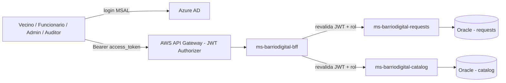
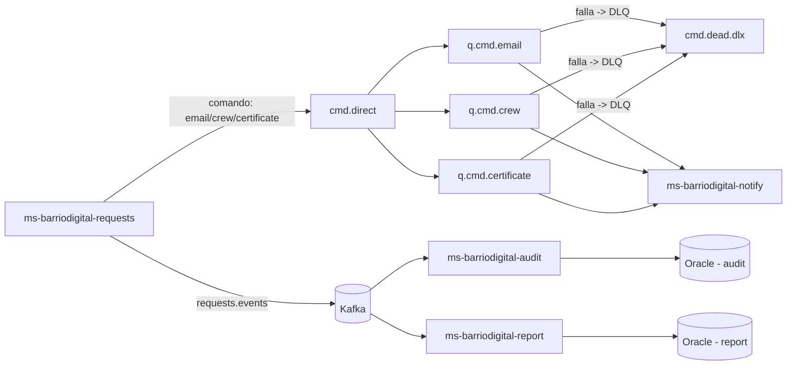
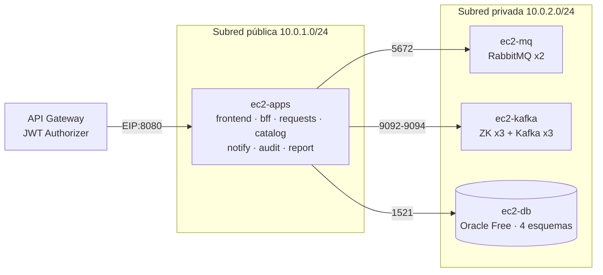

# Arquitectura — BarrioDigital

## Flujo de llamadas seguras (sección 6 del caso)

## Eventos y mensajería (secciones 8 y 9)

## Database per Service

Cada microservicio de dominio (`requests`, `catalog`, `audit`, `report`) tiene su propio esquema Oracle — nadie escribe en la base de otro. `audit` y `report` solo se enteran de lo que pasa en `requests` a través del tópico `requests.events`, nunca leyendo su base directamente.

## Repos

| Repo | Contenido |
|---|---|
| `frontend-barriodigital` | Angular + MSAL |
| `ms-barriodigital-bff` | Valida JWT como el API Gateway, orquesta requests/catalog |
| `ms-barriodigital-requests` | Trámites, máquina de estados, cupos, productor RabbitMQ/Kafka |
| `ms-barriodigital-catalog` | Tipos de trámite y cupos |
| `ms-barriodigital-notify` | Consumidor RabbitMQ (email, cuadrilla, certificado) |
| `ms-barriodigital-audit` | Consumidor Kafka, timeline de auditoría (solo lectura) |
| `ms-barriodigital-report` | Consumidor Kafka, KPIs (solo lectura) |
| `infra` | 3 `docker-compose.yml`: apps / mq / kafka |

## Despliegue AWS (sección 7 del caso)

Solo `ec2-apps` tiene IP pública; `sg-mq`, `sg-kafka` y `sg-db` aceptan tráfico únicamente desde `sg-apps`. El BFF queda expuesto en 8080 porque API Gateway no tiene IPs fijas — por eso el BFF **revalida** el JWT completo en vez de confiar en el Gateway (defensa en profundidad). La alternativa con VPC Link + ALB interno, y por qué no la usamos, está en [AWS-Infraestructura.md](AWS-Infraestructura.md#por-qué-vpc-link-sería-más-seguro-y-por-qué-no-lo-usamos).

## Documentos

| Doc | Qué tiene |
|---|---|
| [Pendientes.md](Pendientes.md) | Backlog único con prioridades, mapeado a la pauta EP1 |
| [Entra-ID-y-JWT.md](Entra-ID-y-JWT.md) | App Registrations, roles, los 3 tokens, qué valida cada capa, gotcha `aud` |
| [AWS-Infraestructura.md](AWS-Infraestructura.md) | VPC, subredes, Security Groups, EC2, Oracle, API Gateway, VPC Link |
| [GitHub-Projects.md](GitHub-Projects.md) | Cómo funciona Projects y cómo lo usamos |
| [CI-CD.md](CI-CD.md) | Workflows listos (CI, imagen a GHCR, deploy SSH), secrets |
| [Requisitos de la Prueba/](Requisitos%20de%20la%20Prueba/) | Caso y pauta originales |
