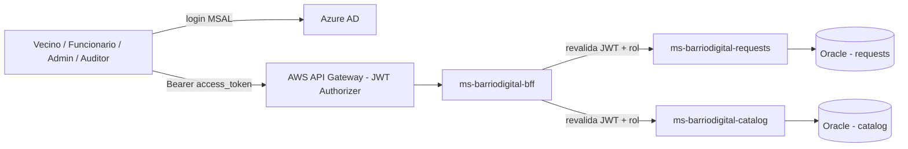
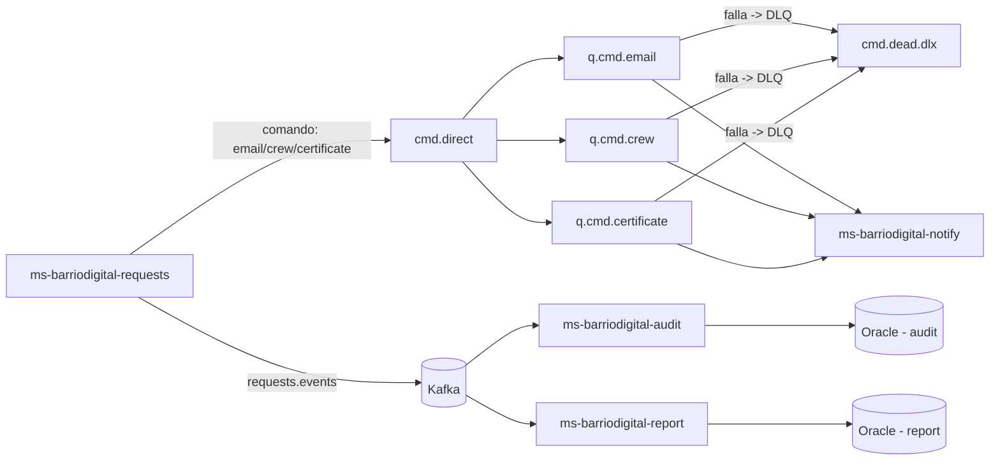

# Arquitectura — BarrioDigital

## Flujo de llamadas seguras (sección 6 del caso)

## Eventos y mensajería (secciones 8 y 9)

## Database per Service

Cada microservicio de dominio (`requests`, `catalog`, `audit`, `report`) tiene su propio esquema Oracle — nadie escribe en la base de otro. `audit` y `report` solo se enteran de lo que pasa en `requests` a través del tópico `requests.events`, nunca leyendo su base directamente.

## Repos

| Repo | Contenido |
|---|---|
| `frontend-barriodigital` | Angular + MSAL |
| `ms-barriodigital-bff` | Valida JWT como el API Gateway, orquesta requests/catalog |
| `ms-barriodigital-requests` | Trámites, máquina de estados, cupos, productor RabbitMQ/Kafka |
| `ms-barriodigital-catalog` | Tipos de trámite y cupos |
| `ms-barriodigital-notify` | Consumidor RabbitMQ (email, cuadrilla, certificado) |
| `ms-barriodigital-audit` | Consumidor Kafka, timeline de auditoría (solo lectura) |
| `ms-barriodigital-report` | Consumidor Kafka, KPIs (solo lectura) |
| `infra` | 3 `docker-compose.yml`: apps / mq / kafka |

Detalle de cada pieza, roles y estado de avance: [`../README.md`](../README.md).
